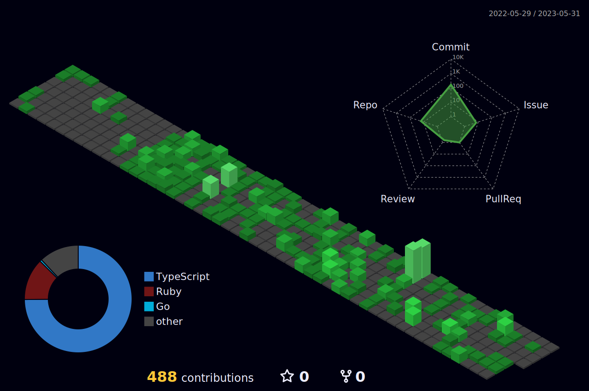

### Hi there 👋
<!-- Qiita Badge --> <!-- Vier Counter -->
  

<!-- Skill Badge -->
<h3 align="left">Languages and Tools:</h3>

  
  
  
  
  
  
  
  
  
  
  
  
  
  

<!-- GitHub stats -->
<!--    -->

